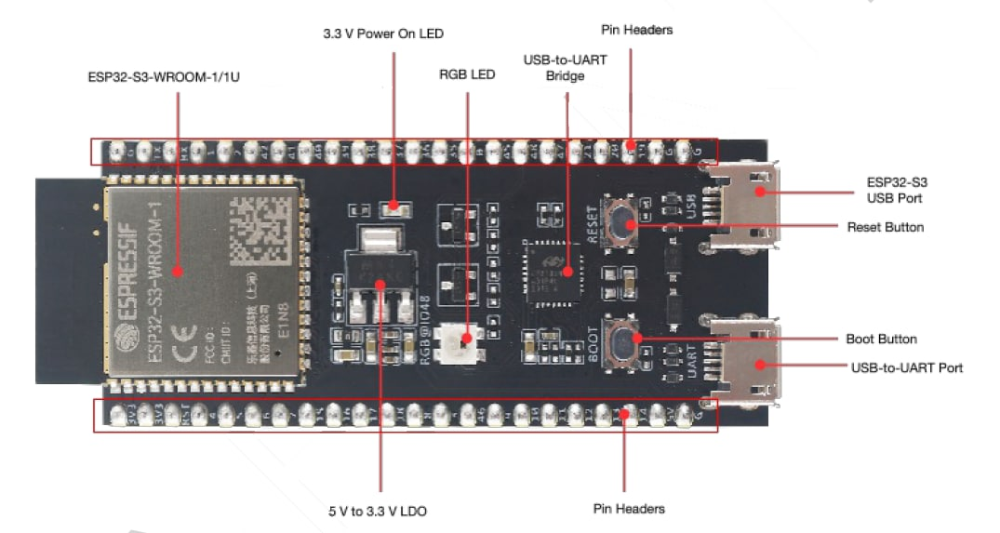

# BLE Remote -> USB HID Bridge (Zwift Navigation Remote)

This turns a cheap Bluetooth handlebar remote (the **DQX-Q7**, 5 buttons)
into a USB keyboard for your PC, so you can navigate the Zwift menus
(arrows / Enter / Esc) without touching the keyboard or mouse — the same
way the old Apple Remote worked on the Apple TV.

An ESP32-S3 board sits in the middle: it listens to the remote over
Bluetooth (BLE) on one side, and plugs into your PC over a USB cable on the
other side, where it shows up as an ordinary USB keyboard. No Bluetooth
pairing is needed on the PC — as far as Windows is concerned, it's just a
keyboard.

The full technical write-up (hardware choice, Bluetooth protocol details,
known quirks) is in [project.md](project.md); this README is the
practical "how do I actually use this" guide.

## What you need

- The ESP32-S3 board (DevKit N16R8), with **two USB-C cables** plugged into
  your PC (see "The two USB ports" below — you need both while setting up).
- Any **DQX-Q7 remote** — no need to know its Bluetooth address ahead of
  time; the firmware finds and remembers it on its own (see "Connecting the
  remote" below).
- [VS Code](https://code.visualstudio.com/) with the **PlatformIO IDE**
  extension installed (search for "PlatformIO IDE" in the Extensions
  panel). PlatformIO handles downloading the right compiler and libraries
  for you — you don't need to install anything else by hand.

## The two USB ports

The board has two USB-C ports and they do different jobs:

| Port | What it's for |
|------|----------------|
| **UART** (labeled on the board, this machine's COM4) | Flashing the firmware and reading the debug log |
| **Native USB** | The one that becomes the "keyboard" your PC sees |



In this photo, the board's own labels map onto the table above like this:

- **"USB-to-UART Port"** (bottom connector, next to the **USB-to-UART Bridge**
  chip and the **Reset**/**Boot** buttons) is the **UART** port — flash and
  monitor here.
- **"ESP32-S3 USB Port"** (top connector) is the **Native USB** port — this
  is the one that shows up as a keyboard once the firmware is running.

Port labeling and position vary by vendor, so if your board looks different,
confirm against its own silkscreen (see project.md section 10 for how to
tell them apart by their Device Manager signature too).

Keep both plugged in while you're setting this up. Once everything works,
you technically only need the native USB port connected for daily use, but
there's no harm in leaving both in.

## The status LED

The board has one onboard LED, and it tells you everything you need to
know about its state at a glance:

| What you see | What it means |
|---|---|
| **Off** (dark) | The firmware isn't running — check the USB cable, or that the upload actually succeeded |
| **Blue, flashing twice then pausing** (blink-blink ... blink-blink ...) | Firmware is running and waiting to connect to the remote |
| **Solid green** | Connected — the remote is paired and ready to use |

This is the fastest way to check things are working without needing the
serial monitor open at all.

## First-time setup (flashing the firmware)

1. Open this project folder in VS Code (`File > Open Folder...`). The
   PlatformIO extension will recognize it automatically (you'll see a
   little PlatformIO icon appear in the sidebar, and a blue status bar at
   the bottom).
2. In that blue status bar, click the **checkmark icon** (Build) first, to
   make sure it compiles.
3. Click the **right-arrow icon** (Upload) to flash it onto the board over
   the UART port.
4. Optional: click the **plug icon** (Serial Monitor) to watch the board's
   log — useful for confirming the remote connected (see next section).

If you prefer the terminal instead of the VS Code buttons:

```sh
pio run                 # compile
pio run -t upload       # flash over UART (COM4)
pio device monitor      # serial log (COM4, 115200)
```

## Connecting the remote (first-time pairing)

You don't need to do anything on the PC — no Bluetooth settings, no
pairing dialog, and no need to know the remote's Bluetooth address. All
the Bluetooth pairing happens between the ESP32 board and the remote,
automatically:

1. Make sure the firmware is flashed and the board's native USB is plugged
   into your PC (it powers the board).
2. **Hold the remote close to the board** (within arm's reach) **and press
   a button on it.** These remotes go to sleep to save battery, and only
   start advertising over Bluetooth again once a button is pressed.
3. The board doesn't know your specific remote's address yet on first
   boot, so it briefly tries connecting to whatever nearby Bluetooth
   devices it sees, checking each one to find the DQX-Q7 among them. In a
   quiet environment this takes a few seconds; in a house full of phones,
   earbuds, and smart devices, it can take a bit of patience — **keep
   tapping a button on the remote every second or two** so it keeps
   advertising while the board works through the candidates. If you have
   the serial monitor open, you'll see it trying (and rejecting) other
   devices before it lands on the right one:
   ```
   [BLE] candidate <some other device>, connecting to verify...
   [BLE] connecting...
   [BLE] not a match, disconnecting and resuming scan
   [BLE] candidate 98:4a:c0:ce:bf:a2, connecting to verify...
   [BLE] connecting...
   [BLE] remote matched, saving 98:4a:c0:ce:bf:a2 to NVS
   [BLE] securing link...
   [BLE] ready
   ```
4. Watch the onboard LED turn from blinking blue to solid green once it's
   found and connected.
5. That's it — press a button and the mapped key should show up wherever
   your cursor/focus is on the PC (try it in a text editor first, then in
   Zwift).

**You only need to do this once.** Once found, the remote's address is
saved to the board's flash (NVS) — every boot after that reconnects to it
directly, no more hunting through nearby devices, and no re-pairing needed
across power cycles or firmware updates.

If it's taking a long time: reset the board and try again — which
specific "wrong" device wins the race to be tried first is random, so a
retry alone often helps. If it never finds it at all, double-check the
remote actually has a fresh battery and is within a meter or so (see
"Using a different/replacement remote" below for why signal strength
matters here).

## Customizing which key each button sends

Open [include/config.h](include/config.h). The part you'll want to edit is
this table:

```cpp
constexpr ButtonMapping kButtonMap[] = {
    {ButtonMask::BACK,       KEY_LEFT_ARROW,  KEY_F10},
    {ButtonMask::FORWARD,    KEY_RIGHT_ARROW, KEY_F3},
    {ButtonMask::VOL_UP,     KEY_UP_ARROW,    0},
    {ButtonMask::VOL_DOWN,   KEY_DOWN_ARROW,  0},
    {ButtonMask::PLAY_PAUSE, KEY_RETURN,      KEY_ESC},
};
```

Each line is one physical button, with 3 columns:

1. **Button** (`ButtonMask::...`) — which physical button this row is for.
   Don't change this column; the five names correspond to the remote's
   five physical buttons (see project.md section 3 if you're curious about
   the underlying Bluetooth bitmask).
2. **Single-tap key** — the key sent immediately when you tap that button
   once.
3. **Double-tap key** — the key sent when you tap that button *twice*
   quickly. Use **`0`** here if you don't want a double-tap action for
   that button — it makes the button fire instantly on every press instead
   of waiting to see if a second tap is coming (that's why the four
   direction buttons feel instant: they have `0` in this column, so
   there's no wait).

"Quickly" is defined by this constant, also in `config.h` (in
milliseconds):

```cpp
constexpr uint32_t DOUBLE_TAP_WINDOW_MS = 300;
```

Raise it if double-taps feel too hard to land, lower it if single taps
feel laggy on buttons that have a double-tap action configured.

### What can I put in the key columns?

- **Letters, digits, and symbols**: just use the character directly, e.g.
  `'a'`, `'Z'`, `'5'`, `' '` (space).
- **Special keys**: use one of these names (defined by the keyboard
  library):

  | Name | Key |
  |------|-----|
  | `KEY_UP_ARROW`, `KEY_DOWN_ARROW`, `KEY_LEFT_ARROW`, `KEY_RIGHT_ARROW` | Arrow keys |
  | `KEY_RETURN` | Enter |
  | `KEY_ESC` | Escape |
  | `KEY_TAB` | Tab |
  | `KEY_BACKSPACE`, `KEY_DELETE` | Backspace / Delete |
  | `KEY_HOME`, `KEY_END` | Home / End |
  | `KEY_PAGE_UP`, `KEY_PAGE_DOWN` | Page Up / Page Down |
  | `KEY_F1` ... `KEY_F12` | Function keys |

After editing, save the file and re-flash (Upload button, or
`pio run -t upload`) for the change to take effect. You do **not** need to
re-pair the remote after reflashing.

## Using a different/replacement remote

Since the board doesn't hardcode any specific unit's address, switching to
a different physical remote (a spare, a replacement after this one
breaks, a friend's unit, etc.) needs no config changes at all — just tell
the board to forget the one it currently remembers:

1. Open the serial monitor (`pio device monitor`, or the plug icon in VS
   Code).
2. Type `forget` and press Enter.
3. The board clears its saved address and goes back into the same
   "hunting for nearby candidates" mode described above — repeat the
   first-time pairing steps with the new remote.

**Why signal strength matters during pairing:** the DQX-Q7's Bluetooth
chip has no name, no advertised services, and no manufacturer data in its
advertisement — there's nothing to filter on except by actually connecting
to a candidate and checking what it is. To avoid that turning into slowly
trying every Bluetooth device in the neighborhood, the board only attempts
candidates with a reasonably strong signal, which is also why it's worth
holding the remote close while pairing: it's a coin-cell-powered chip with
low transmit power to begin with, so "close" here means noticeably closer
than you'd expect for typical Bluetooth accessories.

## Troubleshooting

- **Upload fails with "port busy" / "access denied" on COM4**: close any
  serial monitor window that's already open (VS Code's included, or a
  separate PlatformIO monitor tab) — only one program can use the port at
  a time.
- **Remote won't connect (LED keeps blinking blue and never turns solid)**:
  press a button on it to wake it up; check the serial monitor log for
  `[BLE] ...` lines to see how far it gets.
- **First-time pairing is slow / seems stuck on "connecting..."**: normal
  in a Bluetooth-crowded room — it's trying other nearby devices one at a
  time before reaching the remote. Keep tapping the remote's button, hold
  it close to the board, and/or just reset and try again (see "Connecting
  the remote" above). The LED can look like it stopped blinking during
  this phase too — that's expected, each connection attempt briefly blocks
  the LED animation, not a crash.
- **LED is dark**: the firmware isn't running — check the cable and that
  the upload actually succeeded.
- **Want to pair a different remote**: type `forget` in the serial
  monitor (see "Using a different/replacement remote" above) rather than
  erasing the whole board.
- **Board acts strange after many firmware updates**: a full
  `pio run -t erase` followed by a fresh upload wipes everything, including
  the saved remote pairing — you'll need to redo the "first-time pairing"
  steps above afterward.
